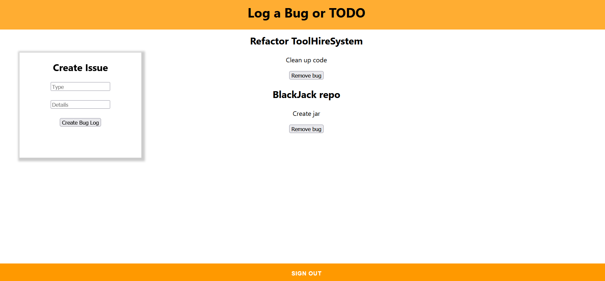

<h2>Application</h2>

The application works as an open forum for logging bugs or TODOs for my own college projects while working alone or as part of a group while still in college. This could act as a kanban board while working remotely.
 

It uses GraphQL subscribers to an API to sync updates across any active users sessions in real time. The application implements user authentication and uses a cloud hosted DynamoDB instance for storage.

This application is focuses on functionality and minimal time was put into the aesthetic of the UI.

[CloudAppDevReport.docx](/CloudAppDevelopment_Mahoney.docx)

<h2>Paper</h2>

<h2>Screenshot</h2>

<h2> Deployed Here </h2>
sign up and verify email to access. 
https://master.d7mo9jltbbuvx.amplifyapp.com/
